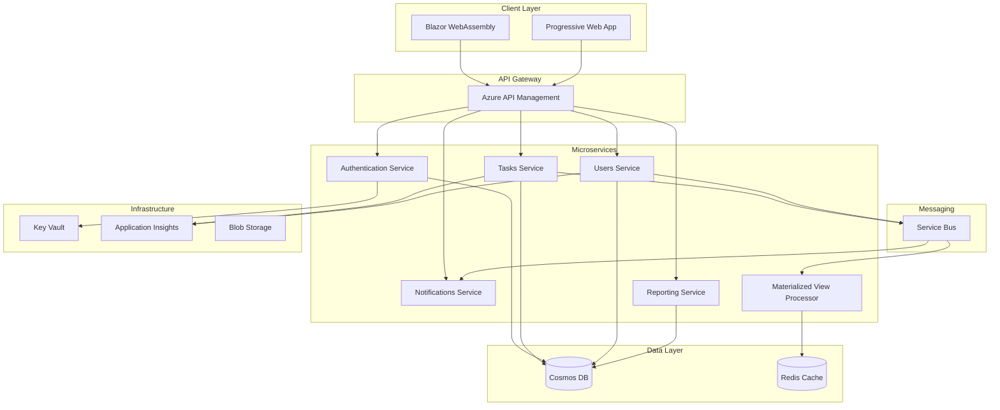
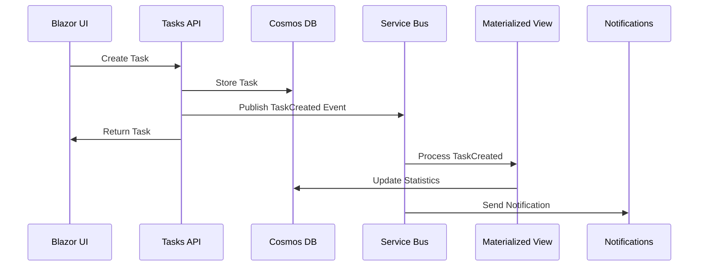

# 🎯 Task Management System

[](https://dotnet.microsoft.com/download/dotnet/8.0)
[](https://blazor.net)
[](https://azure.microsoft.com/services/functions/)
[](https://azure.microsoft.com/services/cosmos-db/)
[](https://opensource.org/licenses/MIT)

A modern, scalable task management system built with **Blazor WebAssembly**, **Azure Functions**, and **Azure Cosmos DB**. This enterprise-grade application features a microservices architecture, real-time updates, and a professional user interface.


## 🚀 Features

### ✨ Core Functionality
- **👥 User Management** - Secure authentication and user profiles
- **📋 Task Operations** - Create, read, update, delete tasks with rich metadata
- **📊 Dashboard Analytics** - Real-time statistics and insights
- **🔔 Real-time Notifications** - Service Bus messaging for instant updates
- **📱 Responsive Design** - Mobile-first, professional UI/UX
- **🔍 Advanced Filtering** - Filter tasks by status, priority, assignee, and dates
- **📈 Reporting** - Task completion analytics and productivity metrics

### 🛡️ Security & Performance
- **🔐 JWT Authentication** - Secure token-based authentication
- **🏗️ Microservices Architecture** - Scalable, maintainable service design
- **☁️ Cloud-Native** - Built for Azure with Infrastructure as Code
- **📊 Materialized Views** - Optimized read performance with CQRS pattern
- **🔄 Event-Driven** - Asynchronous processing with Azure Service Bus

## 🏗️ Architecture

### 📐 System Overview



### 🎯 Domain-Driven Design (DDD)

The application follows DDD principles with clear bounded contexts:

- **👤 User Management Context** - Authentication, profiles, permissions
- **📋 Task Management Context** - Tasks, projects, assignments, deadlines
- **📊 Analytics Context** - Reporting, dashboards, metrics
- **🔔 Notification Context** - Real-time updates, email notifications

### 🔄 Event-Driven Architecture



## 🛠️ Technology Stack

### Frontend
- **🎨 Blazor WebAssembly** - Modern C# SPA framework
- **🎭 HTML5 & CSS3** - Semantic markup and responsive design
- **⚡ Progressive Web App** - Offline capabilities and native-like experience
- **🎯 Bootstrap 5** - Professional UI components

### Backend
- **⚡ Azure Functions v4** - Serverless compute platform
- **🔧 .NET 8** - Latest LTS version with performance improvements
- **📝 C# 12** - Modern language features
- **🏗️ Clean Architecture** - Separation of concerns and testability

### Data & Storage
- **🌍 Azure Cosmos DB** - Globally distributed NoSQL database
- **⚡ Redis Cache** - High-performance caching layer
- **📁 Azure Blob Storage** - File and document storage
- **🔍 Optimized Indexing** - Custom indexing policies for performance

### Infrastructure & DevOps
- **☁️ Azure Cloud Platform** - Scalable cloud infrastructure
- **🏗️ Terraform** - Infrastructure as Code
- **🔄 Azure DevOps** - CI/CD pipelines
- **📊 Application Insights** - Monitoring and telemetry
- **🔐 Azure Key Vault** - Secrets management

### Messaging & Integration
- **📨 Azure Service Bus** - Reliable message queuing
- **🔄 Event-Driven Patterns** - Loose coupling and scalability
- **📡 SignalR** - Real-time web functionality

## 📁 Project Structure

```
TaskManagement/
├── 📁 src/
│   ├── 📁 client/                          # Frontend Application
│   │   └── 📁 TaskManagement.Client/       # Blazor WebAssembly App
│   │       ├── 📁 Layout/                  # App layout components
│   │       ├── 📁 Pages/                   # Razor pages/components
│   │       ├── 📁 Services/                # HTTP clients & business logic
│   │       ├── 📁 wwwroot/                 # Static web assets
│   │       └── 📄 Program.cs               # App entry point
│   │
│   ├── 📁 services/                        # Backend Microservices
│   │   ├── 📁 TaskManagement.AuthService/      # Authentication & Authorization
│   │   ├── 📁 TaskManagement.TasksService/     # Task management operations
│   │   ├── 📁 TaskManagement.UsersService/     # User profile management
│   │   ├── 📁 TaskManagement.NotificationsService/  # Real-time notifications
│   │   ├── 📁 TaskManagement.ReportingService/      # Analytics & reporting
│   │   └── 📁 TaskManagement.MaterializedViewProcessor/  # Data aggregation
│   │
│   ├── 📁 shared/                          # Shared Libraries
│   │   ├── 📁 TaskManagement.Models/       # Domain models & DTOs
│   │   └── 📁 TaskManagement.Shared/       # Common utilities
│   │
│   └── 📁 database/                        # Database Components
│       └── 📁 TaskManagement.DatabaseSeeder/   # Data seeding utilities
│
├── 📁 infra/                              # Infrastructure as Code
│   ├── 📁 terraform/                      # Terraform configurations
│   │   ├── 📁 modules/                    # Reusable Terraform modules
│   │   ├── 📄 main.tf                     # Main infrastructure definition
│   │   ├── 📄 variables.tf                # Input variables
│   │   └── 📄 outputs.tf                  # Output values
│   └── 📁 bicep/                          # Alternative Bicep templates
│
├── 📁 docs/                               # Documentation
│   ├── 📄 API_DOCUMENTATION.md            # API reference
│   ├── 📄 DATABASE_CONFIGURATION.md       # Database setup guide
│   └── 📄 MESSAGING_ARCHITECTURE.md       # Event messaging patterns
│
├── 📁 scripts/                            # Automation Scripts
│   ├── 📄 setup-database.ps1             # Database initialization
│   ├── 📄 setup-servicebus.ps1           # Service Bus configuration
│   └── 📄 deploy-functions.bat           # Functions deployment
│
├── 📄 .gitignore                          # Git ignore rules
├── 📄 README.md                           # This file
└── 📄 TaskManagement.sln                  # Visual Studio solution
```

## 🚀 Quick Start

### Prerequisites

- **📦 .NET 8 SDK** - [Download here](https://dotnet.microsoft.com/download/dotnet/8.0)
- **☁️ Azure Subscription** - [Free account](https://azure.microsoft.com/free/)
- **🔧 Azure CLI** - [Install guide](https://docs.microsoft.com/cli/azure/install-azure-cli)
- **🏗️ Terraform** (Optional) - [Download here](https://www.terraform.io/downloads.html)
- **🎯 Visual Studio 2022** or **VS Code** - Recommended IDEs

### 🛠️ Local Development Setup

1. **Clone the repository**
   ```bash
   git clone https://github.com/yourusername/task-management.git
   cd task-management
   ```

2. **Install Azure Functions Core Tools**
   ```bash
   npm install -g azure-functions-core-tools@4 --unsafe-perm true
   ```

3. **Set up local storage emulator (Azurite)**
   ```bash
   npm install -g azurite
   azurite --silent --location ./azurite --debug ./azurite/debug.log
   ```

4. **Configure local settings**
   ```bash
   # Copy template settings for each service
   cp src/services/TaskManagement.AuthService/local.settings.template.json src/services/TaskManagement.AuthService/local.settings.json
   cp src/services/TaskManagement.TasksService/local.settings.template.json src/services/TaskManagement.TasksService/local.settings.json
   # ... repeat for other services
   ```

5. **Create local.settings.json from templates (do not commit these)**
    - Copy template files and fill in your local values:
       - `src/services/TaskManagement.UsersService/local.settings.template.json` → `local.settings.json`
       - `src/services/TaskManagement.TasksService/local.settings.template.json` → `local.settings.json`
       - `src/services/TaskManagement.MaterializedViewProcessor/local.settings.template.json` → `local.settings.json`
    - These files are ignored by git; keep secrets local.
   ```json
   {
     "IsEncrypted": false,
     "Values": {
       "AzureWebJobsStorage": "UseDevelopmentStorage=true",
       "FUNCTIONS_WORKER_RUNTIME": "dotnet-isolated",
       "CosmosDbConnectionString": "AccountEndpoint=https://localhost:8081/;AccountKey=C2y6yDjf5/R+ob0N8A7Cgv30VRDJIWEHLM+4QDU5DE2nQ9nDuVTqobD4b8mGGyPMbIZnqyMsEcaGQy67XIw/Jw==",
       "ServiceBusConnectionString": "UseDevelopmentStorage=true"
     }
   }
   ```

6. **Run the solution locally**
   ```bash
   # Terminal 1: Start Functions (Backend Services)
   .\run-local.ps1

   # Terminal 2: Start Blazor Client
   cd src/client/TaskManagement.Client
   dotnet run
   ```

7. **Access the application**
   - 🌐 **Frontend**: http://localhost:5000
   - ⚡ **Functions**: http://localhost:7071 (Auth), http://localhost:7072 (Tasks)

### ☁️ Azure Deployment

#### Option 1: Terraform (Recommended)

1. **Navigate to infrastructure directory**
   ```bash
   cd infra/terraform
   ```

2. **Initialize Terraform**
   ```bash
   terraform init
   ```

3. **Configure variables**
   ```bash
   cp terraform.tfvars.example terraform.tfvars
   # Edit terraform.tfvars with your values
   ```

4. **Deploy infrastructure**
   ```bash
   terraform plan
   terraform apply
   ```

#### Option 2: Azure CLI Quick Deploy

```bash
# Create resource group
az group create --name TaskManagement-RG --location "East US"

# Deploy using ARM template
az deployment group create \
  --resource-group TaskManagement-RG \
  --template-file infra/bicep/main.bicep \
  --parameters @infra/bicep/parameters.json
```

## 📚 API Documentation

### 🔐 Authentication Endpoints

| Method | Endpoint | Description |
|--------|----------|-------------|
| POST | `/api/auth/register` | Register new user |
| POST | `/api/auth/login` | User authentication |
| POST | `/api/auth/refresh` | Refresh JWT token |
| POST | `/api/auth/logout` | User logout |

### 📋 Task Management Endpoints

| Method | Endpoint | Description |
|--------|----------|-------------|
| GET | `/api/tasks` | Get all tasks |
| GET | `/api/tasks/user/{userId}` | Get user tasks |
| GET | `/api/tasks/{id}` | Get task by ID |
| POST | `/api/tasks` | Create new task |
| PUT | `/api/tasks/{id}` | Update task |
| DELETE | `/api/tasks/{id}` | Delete task |
| GET | `/api/tasks/dashboard/stats` | Get dashboard statistics |

### 👥 User Management Endpoints

| Method | Endpoint | Description |
|--------|----------|-------------|
| GET | `/api/users` | Get all users |
| GET | `/api/users/{id}` | Get user by ID |
| PUT | `/api/users/{id}` | Update user profile |
| DELETE | `/api/users/{id}` | Delete user |

## 🗄️ Database Schema

### User Entity
```json
{
  "id": "string",
  "email": "string",
  "firstName": "string",
  "lastName": "string",
  "department": "string",
  "role": "User|Manager|Admin",
  "createdAt": "datetime",
  "updatedAt": "datetime"
}
```

### Task Entity
```json
{
  "id": "string",
  "title": "string",
  "description": "string",
  "status": "ToDo|InProgress|Completed|Cancelled",
  "priority": "Low|Medium|High|Critical",
  "assignedToUserId": "string",
  "createdByUserId": "string",
  "dueDate": "datetime",
  "createdAt": "datetime",
  "updatedAt": "datetime",
  "completedAt": "datetime?"
}
```

### 📊 Performance Optimizations

- **Cosmos DB Indexing Policies** - Custom indexing for optimal query performance
- **Partition Key Strategy** - Efficient data distribution using `userId`
- **Materialized Views** - Pre-aggregated statistics for dashboard performance
- **Redis Caching** - Cached frequently accessed data

## 🧪 Testing

### Unit Tests
```bash
# Run all unit tests
dotnet test

# Run with coverage
dotnet test --collect:"XPlat Code Coverage"
```

### Integration Tests
```bash
# Run integration tests
dotnet test --filter Category=Integration
```

### Load Testing
```bash
# Using Azure Load Testing
# Configuration files in tests/load-testing/
```

## 📊 Monitoring & Observability

### Application Insights Integration
- **📈 Performance Metrics** - Response times, throughput, error rates
- **🔍 Distributed Tracing** - End-to-end request tracking
- **🚨 Custom Alerts** - Proactive monitoring and notifications
- **📊 Custom Dashboards** - Business-specific KPIs

### Health Checks
```bash
# Check service health
curl https://your-functions-app.azurewebsites.net/api/health
```

## 🔒 Security

### Authentication & Authorization
- **🎫 JWT Tokens** - Stateless authentication
- **🛡️ Role-Based Access Control** - Fine-grained permissions
- **🔐 Azure Key Vault** - Secure secrets management
- **🌐 CORS Configuration** - Proper cross-origin resource sharing

### Data Protection
- **🔒 Encryption at Rest** - Cosmos DB automatic encryption
- **🚄 Encryption in Transit** - HTTPS/TLS for all communications
- **🔑 Managed Identity** - Azure services authentication
- **🔍 Audit Logging** - Comprehensive activity tracking

## 🚀 Performance Features

### Scalability
- **📈 Serverless Functions** - Automatic scaling based on demand
- **🌍 Global Distribution** - Cosmos DB multi-region replication
- **⚡ CDN Integration** - Fast static content delivery
- **🔄 Load Balancing** - Automatic traffic distribution

### Optimization
- **📊 Query Optimization** - Efficient Cosmos DB queries
- **💾 Caching Strategy** - Redis for frequently accessed data
- **📦 Bundle Optimization** - Minimal Blazor WebAssembly payload
- **🗜️ Compression** - Gzip compression for API responses

## 🤝 Contributing

We welcome contributions! Please see our [Contributing Guide](CONTRIBUTING.md) for details.

1. **🍴 Fork the repository**
2. **🌿 Create a feature branch** (`git checkout -b feature/amazing-feature`)
3. **💾 Commit your changes** (`git commit -m 'Add amazing feature'`)
4. **📤 Push to the branch** (`git push origin feature/amazing-feature`)
5. **🔀 Open a Pull Request**

### Development Guidelines
- ✅ Follow [C# Coding Conventions](https://docs.microsoft.com/dotnet/csharp/programming-guide/inside-a-program/coding-conventions)
- ✅ Write unit tests for new features
- ✅ Update documentation for API changes
- ✅ Use conventional commit messages

## 📄 License

This project is licensed under the MIT License - see the [LICENSE](LICENSE) file for details.

## 👥 Authors & Contributors

- **Your Name** - *Initial work* - [@yourusername](https://github.com/yourusername)

## 🙏 Acknowledgments

- Microsoft for the excellent .NET and Azure platform
- The Blazor community for innovative web development approaches
- Azure Functions team for serverless computing excellence

## 📞 Support & Contact

- 📧 **Email**: support@taskmanagement.com
- 🐛 **Issues**: [GitHub Issues](https://github.com/yourusername/task-management/issues)
- 💬 **Discussions**: [GitHub Discussions](https://github.com/yourusername/task-management/discussions)
- 📖 **Documentation**: [Wiki](https://github.com/yourusername/task-management/wiki)

---

<p align="center">
  Made with ❤️ and ☕ by the Task Management Team
</p>

<p align="center">
  <a href="#-task-management-system">Back to top ⬆️</a>
</p>
